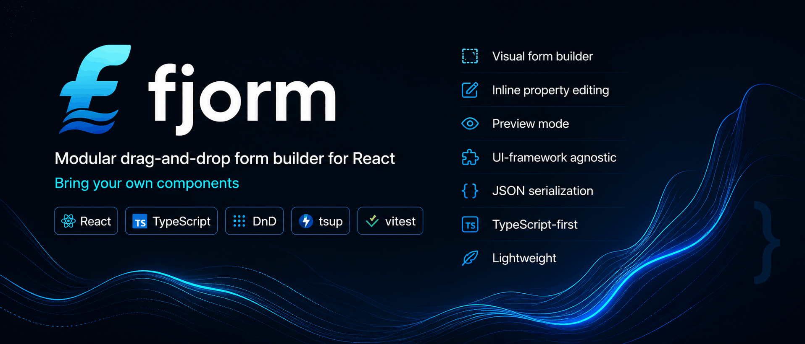

> Modular drag-and-drop form builder for React — bring your own components.

[](https://github.com/WEeziel172/fjorm/actions/workflows/ci.yml)
[](https://weeziel172.github.io/fjorm/)
[](https://github.com/semantic-release/semantic-release)
[](LICENSE)
[](https://www.typescriptlang.org/)
[](https://react.dev/)

Fjorm lets you build visual, drag-and-drop form editors in React. Drag components from a toolbox onto a canvas, configure each field's properties in a sidebar editor, preview the live form, and serialize the result as JSON. The rendering layer is completely pluggable — use raw HTML inputs, Ant Design, MUI, Mantine, or your own design system.

📖 **Full documentation:** [weeziel172.github.io/fjorm](https://weeziel172.github.io/fjorm/)

<p align="center">
  
  
  
</p>

---

## ✨ Features

- **Visual form builder** — drag components from a palette onto a canvas
- **Inline property editing** — edit labels, placeholders, required flags, select options
- **Preview mode** — toggle between builder and rendered-form views
- **UI-framework agnostic** — register your own display components per field type
- **JSON serialization** — export/import form structure as portable JSON
- **TypeScript-first** — full type definitions for the component registry and all APIs
- **Lightweight** — peer-deps only: React and `@hello-pangea/dnd`

---

## 📦 Install

```bash
npm install fjorm
```

Fjorm requires React 19+ and `@hello-pangea/dnd` (installed automatically as a dependency):

```bash
npm install fjorm react react-dom
```

---

## 🚀 Quick Start

```tsx
import { Config, FormBuilder, formComponents } from 'fjorm'
import 'fjorm/dist/index.css'

export default function App() {
  const config = new Config()
  config.addComponents(formComponents)

  return (
    <div style={{ height: '100vh' }}>
      <FormBuilder config={config} />
    </div>
  )
}
```

That's it — you get a working drag-and-drop form builder with four built-in field types: Header, Paragraph, TextInput, and SelectInput.

---

## 🎨 Adapter Pattern — Bring Your Own Components

Fjorm's real power comes from swapping in your own UI library. Register custom display components for each field type, and the builder renders them everywhere — on the canvas, in the preview, and in the final form.

### Example: Ant Design

```tsx
import { Form, Input, Select, Typography } from 'antd'
import type { FormComponentRegistration, FormComponentProps } from 'fjorm'

// 1. Define display components wrapping Ant Design primitives
function AntTextInput({ settings, label }: FormComponentProps) {
  return (
    <Form.Item label={label} name={settings.name}
      rules={settings.required ? [{ required: true, message: 'Required' }] : undefined}>
      <Input placeholder={settings.placeholder as string} />
    </Form.Item>
  )
}

// 2. Define a form wrapper for the preview/display mode
function FormWrapper({ children }: { children: React.ReactNode }) {
  return <Form layout="vertical">{children}<button type="submit">Save</button></Form>
}

// 3. Register everything in the component array
const myComponents: FormComponentRegistration[] = [
  {
    key: 'TextInput',
    icon: FaTextHeight,
    settings: { label: 'Text input', name: 'TextInput' },
    component: AntTextInput,
    editor: { label: 'EditorInput', placeholder: 'EditorInput', name: 'EditorInput', required: 'EditorCheckbox' },
  },
  // ... other field types
]

// 4. Wire it up
const config = new Config()
config.addComponents(myComponents)
<FormBuilder config={config} form={{ component: FormWrapper }} />
```

The `editor` property on each registration tells Fjorm what sidebar editor fields to show. Use the **declarative object form** (shown above) for common editor field combinations, or pass a **custom React component** for full control.

### 📚 Example Apps

Ready-to-run examples for three major component libraries:

| Library            | Directory           | Dev Command   |
| ------------------ | ------------------- | ------------- |
| **Ant Design v5**  | `examples/antd/`    | `npm run dev` |
| **Material UI v5** | `examples/mui/`     | `npm run dev` |
| **Mantine v7**     | `examples/mantine/` | `npm run dev` |

Each example includes a `FormWrapper`, four field types (Header, Paragraph, TextInput, SelectInput), and a ready-to-run Vite setup.

---

## 📖 API Reference

### `Config`

The central registry. Register form component definitions.

```ts
class Config {
  get components(): FormComponentRegistration[]
  getComponent(key: string): FormComponentRegistration | undefined
  addComponents(arr: readonly FormComponentRegistration[]): void
}
```

`addComponents` warns on duplicate keys and rebuilds the internal lookup index. Use `getComponent(key)` for O(1) lookups instead of indexing into the components array directly.

### `FormComponentRegistration`

Each registered field type follows this shape:

```ts
interface FormComponentRegistration {
  key: string // unique identifier, e.g. "TextInput"
  settings: FormComponentSettings // default field settings (label, name, …)
  icon: ComponentType // icon shown in the toolbox
  component: ComponentType<FormComponentProps> // display component
  editor: ComponentType<EditorProps> | Record<string, string> // editor definition
  options?: FormComponentOption[] // default options (for selects)
}
```

**Two editor modes:**

- **Function** — pass any React component receiving `EditorProps`
- **Object** — declarative key→editor-type mapping, e.g. `{ label: 'EditorInput', required: 'EditorCheckbox' }`. Available editor types: `EditorInput`, `EditorCheckbox`, `EditorTextArea`, `EditorOptions`.

### `FormBuilder`

```tsx
<FormBuilder
  ref={builderRef} // FormBuilderHandle — getFormItems(), reset()
  config={config} // Config instance (required)
  form={{ component: FormWrapper }} // custom form wrapper for preview mode
  initialData={savedForm} // pre-populate the builder with serialized data
  onChange={(structure) => {}} // called when form structure changes (drag, edit, delete)
  onSubmit={(formData) => {}} // called when the default preview form is submitted
/>
```

> **Note:** `onSubmit` only fires for the default `<form>` (no custom wrapper). When using a custom `form.component`, the wrapper handles its own submission — wire your submit logic inside the wrapper instead.

**Imperative handle** — access via `useRef<FormBuilderHandle>`:

```ts
interface FormBuilderHandle {
  getFormItems(): SerializedFormItem[] // current form structure as JSON
  reset(): void // clear all form items
}
```

### `FormDisplay`

Standalone read-only form renderer (used internally by `FormBuilder` in preview mode):

```tsx
<FormDisplay
  data={serializedItems} // SerializedFormItem[]
  config={config} // Config instance
  form={formWrapper} // optional custom form wrapper
/>
```

### Serialization Utilities

```ts
import { serializeFormItems, deserializeFormItems } from 'fjorm'

// Export form structure as portable JSON
const json: SerializedFormItem[] = serializeFormItems(formItems)

// Rehydrate from saved JSON
const formItems: FormItem[] = deserializeFormItems(json, config)
```

### Exports

The public API is intentionally small. Build your own display components (see Adapter Pattern above) — the library provides the framework, not the fields.

| Export                 | Kind      | Description                                                               |
| ---------------------- | --------- | ------------------------------------------------------------------------- |
| `Config`               | Class     | Component registry                                                        |
| `FormBuilder`          | Component | Main builder UI (named export)                                            |
| `FormDisplay`          | Component | Standalone read-only form renderer                                        |
| `formComponents`       | Value     | Default component definitions (Header, Paragraph, TextInput, SelectInput) |
| `serializeFormItems`   | Function  | Convert form items to portable JSON                                       |
| `deserializeFormItems` | Function  | Rehydrate JSON back to form items                                         |

**Types:**

```ts
import type {
  FormComponentSettings,
  FormComponentOption,
  EditorProps,
  FormComponentProps,
  FormComponentRegistration,
  FormItem,
  SerializedFormItem,
  FormConfig,
  EditorDefinition,
  EditorChangePayload,
  FormBuilderHandle,
} from 'fjorm'
```

---

## 🛠 Development

```bash
# Install dependencies
npm install

# Build the library (ESM + CJS + type declarations)
npm run build

# Watch mode
npm run dev

# Run tests
npm test

# Run tests in watch mode
npm run test:watch

# Run the demo app
cd demo && npm run dev

# Run an example app
cd examples/antd && npm run dev
cd examples/mui && npm run dev
cd examples/mantine && npm run dev
```

### Releases

This project uses [semantic-release](https://semantic-release.gitbook.io) for fully automated versioning. Commits to `main` trigger the CI pipeline, which determines the next version from commit messages, publishes to npm, and creates a GitHub Release.

**Commit conventions** (Conventional Commits):

```
fix: fix crash when deleting edited form item    → patch release (1.0.0 → 1.0.1)
feat: add checkbox field type                    → minor release (1.0.0 → 1.1.0)
feat: redesign public API
BREAKING CHANGE: Config.addComponents signature  → major release (1.0.0 → 2.0.0)
```

No manual version bumping, tagging, or release drafting needed — merge to `main` and semantic-release handles the rest.

### Project Structure

```
fjorm/
├── src/
│   ├── index.ts              # public API barrel
│   ├── types.ts              # TypeScript type definitions
│   ├── styles.css            # builder UI styles
│   ├── utils/
│   │   ├── config.ts         # Config class
│   │   └── useEditorChange.ts  # shared editor change handler
│   └── components/
│       ├── atoms/            # 9 primitive components
│       ├── molecules/        # 13 composite components
│       ├── organisms/        # 9 business-logic components
│       ├── componentUtils/   # dynamic editor compiler
│       └── builderComponents.ts  # default component definitions
├── tests/
│   ├── setup.ts
│   └── unit/                 # 33 tests across 6 files
├── demo/                     # Vite + React demo app
├── examples/
│   ├── antd/                 # Ant Design v5 integration
│   ├── mui/                  # Material UI v5 integration
│   └── mantine/             # Mantine v7 integration
├── tsup.config.ts            # library build config
├── vitest.config.ts          # test config
└── tsconfig.json
```

---

## 🔑 Key Concepts

### How Values Flow

Fjorm supports two value paths — native inputs are captured automatically via the browser's `FormData`, and complex non-native components use the `onChangeValue` callback.

**Default form (built-in `<form>`):**

1. Simple components (`<input>`, `<select>`, `<textarea>`) are uncontrolled — the browser owns their state
2. Complex components (list switchers, tag pickers, custom widgets) call `onChangeValue` to push their value into the form
3. On submit, tracked values take priority over `FormData`, and unchecked checkboxes default to `false`

**Custom form wrapper (UI library integration):**

1. The wrapper receives `fjormValues: Record<string, unknown>` as a prop — all `onChangeValue`-tracked values
2. The wrapper merges `fjormValues` with its own form state on submit
3. See the Mantine example's `FormWrapper` for a working implementation

**Pre-filling values:**

```tsx
const data: SerializedFormItem[] = [
  { id: '1', key: 'TextInput', settings: { label: 'Email', name: 'email' }, value: 'prefilled@test.com' },
  { id: '2', key: 'ListSwitcher', settings: { label: 'Pages', name: 'pages' }, value: ['1', '3'] },
]
<FormDisplay data={data} config={config} onSubmit={handleSubmit} />
```

**Building a component that uses `onChangeValue`:**

```tsx
function ListSwitcher({ settings, options, value, onChangeValue }: FormComponentProps) {
  const [selected, setSelected] = useState<Set<string>>(
    new Set(Array.isArray(value) ? (value as string[]) : []),
  )

  function toggle(id: string) {
    const next = new Set(selected)
    next.has(id) ? next.delete(id) : next.add(id)
    setSelected(next)
    onChangeValue?.(Array.from(next)) // push array up to the form
  }

  return (
    <div>
      <label>{settings.label}</label>
      {(options ?? []).map((item) => (
        <button
          key={item.id}
          onClick={() => toggle(item.id)}
          style={{ background: selected.has(item.id) ? 'blue' : 'gray' }}
        >
          {item.title}
        </button>
      ))}
    </div>
  )
}
```

The editor for this component uses `EditorOptions` to let users configure the selectable items — see `examples/mantine/src/formComponents.tsx` for the full working version.

### Building Custom Editors from Primitives

When the declarative editor object isn't enough, compose a custom editor from Fjorm's primitives:

```tsx
import {
  EditorInput,
  EditorCheckbox,
  EditorTextArea,
  EditorOptions,
  FormComponentEditorContainer,
  useEditorChange,
  type EditorProps,
} from 'fjorm'

function MyCustomEditor({ settings, options, onValueChange, onChangeOptions }: EditorProps) {
  const handleOnChange = useEditorChange(onValueChange)

  return (
    <FormComponentEditorContainer>
      <EditorInput settings={settings} name="label" label="Label" handleOnChange={handleOnChange} />
      <EditorInput
        settings={settings}
        name="name"
        label="Field name"
        handleOnChange={handleOnChange}
      />
      <EditorCheckbox
        settings={settings}
        name="required"
        label="Required"
        handleOnChange={handleOnChange}
      />
      <EditorOptions
        options={options}
        settings={settings}
        name="options"
        label="Options"
        handleOnChange={handleOnChange}
        handleOnChangeOptions={onChangeOptions ?? (() => {})}
      />
    </FormComponentEditorContainer>
  )
}

// Use it as the editor:
const registration: FormComponentRegistration = {
  key: 'MyComponent',
  settings: { label: 'My Component', name: 'myComponent' },
  icon: MyIcon,
  component: MyDisplayComponent,
  editor: MyCustomEditor, // function form instead of declarative object
}
```

**Available primitives:**

| Export                         | Purpose                                                                       |
| ------------------------------ | ----------------------------------------------------------------------------- |
| `EditorInput`                  | Text input (`label`, `placeholder`, `name` fields)                            |
| `EditorCheckbox`               | Boolean toggle (`required` field)                                             |
| `EditorTextArea`               | Multi-line text (`content` field)                                             |
| `EditorOptions`                | Add/remove/edit option rows (title + value)                                   |
| `FormComponentEditorContainer` | Layout wrapper with consistent padding                                        |
| `useEditorChange`              | Hook — converts `EditorChangePayload` → `{ name, value }` for `onValueChange` |

The declarative object form (`{ label: 'EditorInput', required: 'EditorCheckbox' }`) is just syntactic sugar — `EditorCompiler` maps those keys to these same primitives. Use the function form when you need custom layout, conditional fields, or validation beyond what the declarative form supports.

### How Drag-and-Drop Works

The toolbox (`droppableId="list"`) contains available component types. The canvas (`droppableId="a"`) holds placed form items. Dragging from the toolbox to the canvas calls `addFormItem`, which clones the component definition, assigns a UUID, and inserts it into the form items array. Within the canvas, items can be reordered. Delete and edit actions are available via hover overlays on each item.

### Component Registration Lifecycle

1. Define display components wrapping your UI library's primitives
2. Define editor components (or use declarative editor objects)
3. Create a `FormComponentRegistration[]` array
4. Call `config.addComponents(yourArray)`
5. Pass `config` to `<FormBuilder>`

The config builds an internal `formComponentMappings` index (key → array position) for O(1) lookups during drag operations.

---

## 📄 License

MIT © WEeziel172
